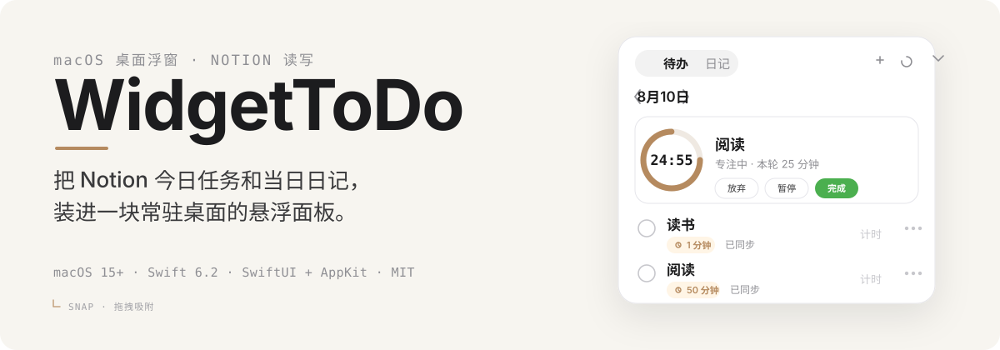
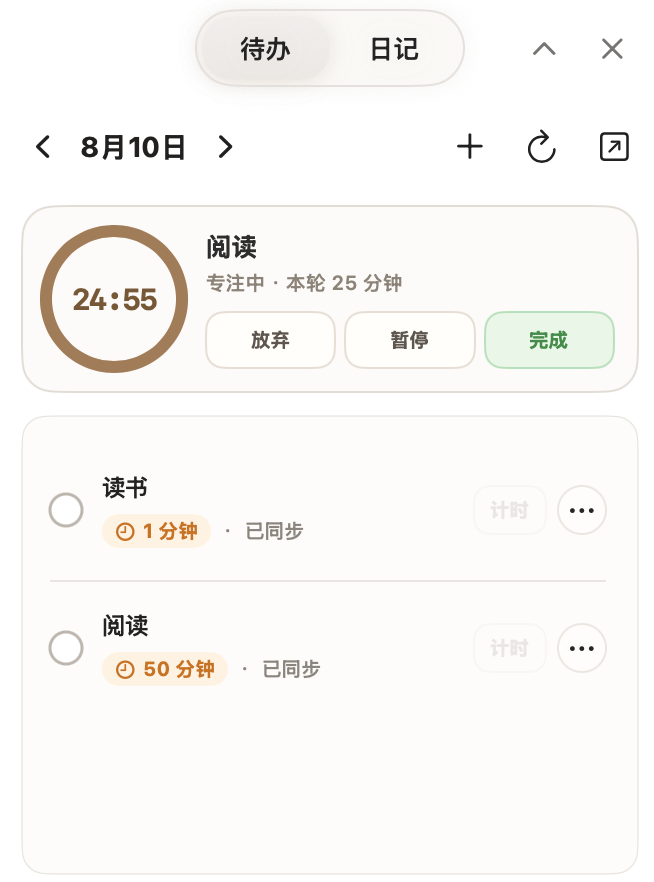
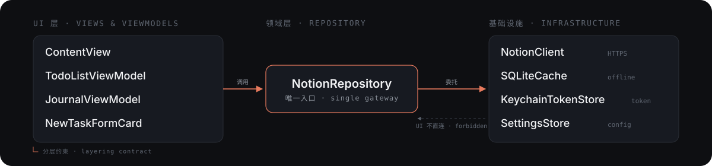

<p align="center">
  <a href="README.md">简体中文</a> | <a href="README.en.md">English</a>
</p>

<p align="center">
  
</p>

<p align="center">
  <a href="#download--installation"></a>
  <a href="#system-requirements"></a>
  <a href="#license"></a>
  <a href="#download--installation"></a>
</p>

> Put your Notion today's tasks and daily journal into an always-on desktop floating panel — no browser, no switching to the Notion app.

## What Is This

WidgetToDo is a **native macOS desktop app** built with SwiftUI + AppKit. It turns your Notion databases into an always-on desktop floating panel, letting you glance at today's to-dos, check off completed tasks, and edit your daily journal — all without leaving your current workflow. Every change syncs back to Notion in real time.

It's not a replacement for Notion, but a **lightweight entry point**:

- **Not a standalone task manager** — your data always lives in Notion; WidgetToDo only displays and edits it.
- **Not a browser extension** — it's an independent macOS app with its own window, menu bar icon, and system notifications.
- **Not a full-featured Notion client** — it focuses on just three things: today's to-dos, daily journal, and a pomodoro timer, deliberately kept lightweight.

Ideal for people who manage daily tasks in Notion but want their to-do list "pinned" to the desktop, always visible.

## The Problem It Solves

If you manage tasks in Notion, every time you want to glance at today's to-dos, check one off, or jot down a journal entry, you have to switch to a browser or the Notion app. WidgetToDo turns these two things into a persistent desktop floating panel:

- **Always on desktop**: Draggable, grid-snapping, multi-layout; collapses into a mini capsule that keeps only the title and key actions.
- **Direct Notion integration**: Reads/writes your Tasks database and journal database; token stored in macOS Keychain, SQLite cache keeps your last-fetched tasks available offline.
- **Native macOS**: Built with SwiftUI + AppKit, menu bar icon, localized in Simplified Chinese / English / French.

<p align="center">
  
</p>

## Features

- **Floating panel**: Draggable, snap-to-grid, collapses into a mini capsule.
- **Today's tasks**: Check off, create, and edit Notion tasks.
- **New task**: Title/status/estimated duration, with readable validation messages.
- **Daily journal**: Edit today's journal, manually sync to Notion.
- **Pomodoro timer**: Focus timer with task status integration.
- **Status bar icon**: Left-click to summon the panel, right-click for menu.
- **Multi-language**: Simplified Chinese / English / French.
- **Local cache**: SQLite offline access.
- **Secure token**: Stored in Keychain, never in source code or logs.

## System Requirements

| Item | Requirement |
| --- | --- |
| OS | macOS 15.0 or later |
| Swift toolchain | Swift 6.2 |
| Xcode | Xcode 16+ recommended (CommandLineTools-only setups will fail `swift test` with `no such module 'XCTest'`) |
| Notion | A Notion account + a Tasks database + a journal database |

<h3 align="center">⬇️ Download WidgetToDo Now</h3>

<p align="center">
  <a href="https://github.com/klosexf/WidgetToDo/releases">
    
  </a>
</p>

## Download & Installation

### Option 1: Download the DMG (regular users)

Go to [Releases](https://github.com/klosexf/WidgetToDo/releases), download the latest `WidgetToDo-V1.1.dmg`, mount it, and drag `WidgetToDo.app` to your Applications folder.

> The current release is distributed for developers and is **not** signed with a paid Apple Developer certificate. On first launch, macOS may show "cannot verify the developer" or "cannot check for malicious software" — this is normal Gatekeeper behavior for unsigned apps. Use any of these methods to bypass:
>
> 1. **System Settings**: Go to **System Settings → Privacy & Security**, then click "Open Anyway".
> 2. **Right-click open**: In Finder, locate `WidgetToDo.app`, **right-click → Open**, then confirm in the dialog.
> 3. **Terminal (remove quarantine attribute)**:
>
>    ```bash
>    xattr -cr /Applications/WidgetToDo.app
>    ```
>
>    Then double-click the app again.

### Option 2: Build from source (developers)

```bash
git clone git@github.com:klosexf/WidgetToDo.git
cd WidgetToDo
open WidgetToDo.xcodeproj
```

In Xcode, select the `WidgetToDo` scheme and press `⌘R` to run. On first launch, the welcome screen will prompt you for a Notion integration token and ask you to select your Tasks and journal databases.

## Configure Notion Integration

The setup has 5 steps: create an integration token → set up databases → share the integration → enter configuration in the app.

### Step 1: Create a Notion Integration Token

1. Go to [notion.so/my-integrations](https://www.notion.so/my-integrations) and click **"Create new integration"**.
2. Fill in a name (e.g. `WidgetToDo`), select your Workspace, and check **Read content, Update content, Insert content** capabilities.
3. After creation, copy the `secret_xxx` token — **it's only shown once**, so save it somewhere safe.

### Step 2: Set Up the Tasks Database

Create a new **Full Page Database** in Notion (not an inline database embedded in a page) to serve as your Tasks database.

**Required fields (3 — all mandatory, exactly 1 of each type):**

| Purpose | Notion Property Type | Field Name | Notes |
| --- | --- | --- | --- |
| Task title | **Title** | Custom, e.g. `Name` | Built-in; usually named `Name` by default |
| Task date | **Date** | Custom, e.g. `Date` | The app filters today's tasks by this field |
| Done status | **Checkbox** | Custom, e.g. `Done` | Checked = completed |

**Optional field (1 — only effective if exactly 1 of this type exists):**

| Purpose | Notion Property Type | Field Name | Notes |
| --- | --- | --- | --- |
| Estimated duration | **Number** | Custom, e.g. `Estimated` | In minutes, e.g. `30` = 30 min |

> ⚠️ **Field count constraint**: Each **required** type (title / date / checkbox) must exist **exactly once** in the database. If you have 2 checkbox fields, the app can't determine which to use and will report a validation error. The same applies to optional fields: 2 number fields will disable the duration feature.

### Step 3: Set Up the Journal Database

Create another **Full Page Database** to serve as your Journal database.

**Required fields (2 — all mandatory, exactly 1 of each type):**

| Purpose | Notion Property Type | Field Name | Notes |
| --- | --- | --- | --- |
| Journal title | **Title** | Custom, e.g. `Name` | The app auto-generates titles like "日记 2026-08-10" |
| Journal date | **Date** | Custom, e.g. `Date` | The app uses this to find/create the daily entry |

> Journal **body text** is written directly into the Notion page content area — **no** extra text property is needed. A Gallery view is recommended for the Journal database for easier browsing.

### Step 4: Share the Integration with Both Databases

Integrations cannot access any database by default — you must **share each database explicitly**:

1. Open the Tasks database → click the `···` menu in the top-right → **"Connections"** → search for your integration name (e.g. `WidgetToDo`) → click to add.
2. Repeat for the Journal database.
3. Confirm that both databases have the integration connected.

> If you still get permission errors after sharing, check your Workspace settings to ensure integrations are allowed to access restricted pages.

### Step 5: Enter Configuration in the App

1. Launch WidgetToDo to enter the onboarding screen.
2. Paste the `secret_xxx` token from Step 1.
3. Get the database link: open the Tasks database in Notion → click `Share` in the top-right → `Copy link` (or just copy the full URL from your browser's address bar).
4. Paste the full URL into the "Tasks Database ID" field — the app automatically extracts the database ID from the URL, no manual trimming needed.
5. Repeat for the Journal database, pasting into "Journal Database ID".
6. Click save. The app validates the database fields automatically and enters the main interface once validation passes.

> The token is stored in macOS Keychain; configuration is persisted via `SettingsStore` to Application Support. Neither ever enters the source code.

## Architecture & Layers

This is a single-repo native macOS project. The testable core logic is exposed as a `NotionFloatCore` SwiftPM library, while the app layer is assembled via an Xcode project. The UI layer never makes Notion requests directly — everything goes through:

<p align="center">
  
</p>

Reusable pure logic for window dragging, snapping, and layout lives in `Core/Services/` for `swift test` coverage; the AppKit/SwiftUI layer only consumes the computed results.

### Directory Structure

```text
WidgetToDo/
├── WidgetToDo/                     # App layer
│   ├── WidgetToDoApp.swift         # Entry point
│   ├── AppCoordinator.swift        # App coordinator
│   ├── FloatingWindowManager.swift # Floating window management
│   ├── StatusBarController.swift   # Menu bar icon
│   ├── ContentView.swift           # Main panel (Todo / Journal / Settings)
│   ├── TodoListViewModel.swift     # Todo list ViewModel
│   ├── JournalViewModel.swift      # Journal ViewModel
│   ├── NewTaskFormCard.swift       # New task form
│   ├── PomodoroViews.swift         # Pomodoro timer
│   ├── MiniCapsuleViews.swift      # Mini capsule mode
│   ├── WelcomeView.swift           # Onboarding flow
│   ├── LanguageStore.swift         # Localization strings
│   ├── Core/
│   │   ├── Models/                 # Shared models (TaskItem / NewTaskDraft / AppSettings)
│   │   ├── Infrastructure/         # NotionClient / NotionRepository / SQLiteCache / KeychainTokenStore / SettingsStore
│   │   └── Services/               # Pure logic (field mapping / window snap algorithm / validators)
│   ├── WidgetToDo.entitlements     # Only declares network.client
│   └── *.lproj/                    # Localization resources (zh-Hans / en / fr)
├── Tests/
│   ├── NotionFloatCoreTests/       # XCTest unit tests
│   └── NotionFloatCoreSmokeTests/  # Executable smoke contracts
├── docs/superpowers/
│   ├── specs/                      # Design documents
│   └── plans/                      # Implementation plans
├── Package.swift                   # SwiftPM definition (NotionFloatCore)
└── progress.md                     # Cross-session execution status and recent verifications
```

> Outside the repo (in the local working directory), there are also `AGENTS.md` (collaboration conventions) and `bugs.md` (known issues / failed approaches) — these are not committed to git and serve as local development references.

## Build & Test

```bash
# Build the Core library
swift build

# Run the full unit test suite (requires full Xcode toolchain)
DEVELOPER_DIR=/Applications/Xcode.app/Contents/Developer swift test

# Run a single test suite
swift test --filter WindowSnapLayoutEngineTests

# Run smoke contracts (executable)
swift run NotionFloatCoreSmokeTests

# Build the app with Xcode (if the active developer directory points to CommandLineTools, specify explicitly)
DEVELOPER_DIR=/Applications/Xcode.app/Contents/Developer xcodebuild \
  -project WidgetToDo.xcodeproj -scheme WidgetToDo -configuration Debug build
```

## Packaging & Release

DMG artifacts are generated with `create-dmg`, named like `WidgetToDo-V1.1.dmg`, and distributed via GitHub Releases. `*.dmg` is added to `.gitignore` and never enters the repo.

## Development Conventions

This repo follows a set of collaboration conventions shared between AI agents and human contributors (`AGENTS.md`, maintained locally, not in git), covering task classification, standard execution flow, verification loops, rollback protocols, and hard prohibitions. Before opening a PR, please request a copy from the maintainer or discuss in an issue.

Key points:

- Tokens go in Keychain, configuration goes in SettingsStore — **never hardcode**.
- Network errors and field validation errors must keep **readable Chinese descriptions** — no bare English system errors.
- New window dragging / snapping / layout algorithms should be implemented as **pure computation** first, consumed by the UI layer afterward.
- Modifying `Package.swift`, `.xcodeproj`, `entitlements`, persistence logic, or the Notion API contract is considered high-risk — please explain the impact in your PR.
- Never write Notion tokens into source code, logs, screenshot annotations, or test snapshots.

## Known Issues & Risks

Historical pitfalls and failed approaches are recorded in a local `bugs.md` (not in git). Before fixing a bug, please search that file first to avoid repeating mistakes. To learn about known risks, ask the maintainer in an issue.

## License

This project is open-sourced under the [MIT License](LICENSE). You are welcome to use, modify, and distribute it — just keep the copyright notice.
